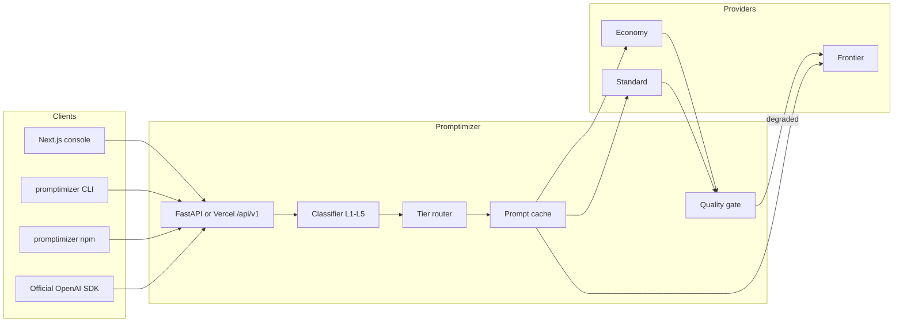

# Promptimizer

Quality-aware LLM routing for any OpenAI-compatible key.

Promptimizer sits in front of a cheap model and a frontier model (real providers or the built-in simulator). It classifies each request, routes it to the cheapest adequate tier, caches repeated system/context prefixes, and reports **cost saved versus always-frontier** on a fixed benchmark — together with a **quality score**, so savings that come from silently worse answers are visible.

**BYOK.** Paste a key for a known host (OpenAI, Groq, Baseten, OpenRouter, …). We already have the base URL. Custom is the only case that asks for one. We fetch `/v1/models`, auto-tier them, and route. Savings land on `/portal` and in the CLI.

## Why this stack

| Piece | Choice | Why |
| --- | --- | --- |
| Gateway | FastAPI / Python 3.12 | OpenAPI, Redis, self-host |
| Console + marketing | Next.js 15 on Vercel | Accounts, API keys, and the production `/api/v1` |
| SDK | TypeScript, `npm i promptimizer` | Dynaroute-style drop-in + offline classifier |
| Cache | In-memory or Redis | Prompt-prefix hits in Compose; memory for the simulator |
| Deploy | Docker Compose + Vercel | Production-shaped local, one-click web |

Theme is jet chrome with a **gold** accent — savings you can see, not another purple AI gradient.

## Architecture



## Monorepo

```
apps/api          FastAPI gateway, classifier, cache, benchmark
apps/web          Next.js marketing + console + /docs
apps/docs         Mintlify source (same IA as /docs)
packages/sdk      promptimizer npm package
packages/cli      promptimizer binary (login, connect, chat, savings)
docs/             Internal notes (architecture, API, SDK)
```

## Run locally

```bash
# JS workspace (npm or pnpm)
npm install
npm run dev:web
# or: pnpm install && pnpm --filter @promptimizer/web dev

# Python gateway (optional — the web app already serves /api/v1)
cd apps/api
python3 -m venv .venv
.venv/bin/pip install -e ".[dev]"
.venv/bin/uvicorn app.main:app --reload --port 8000
```

Open [http://localhost:3000](http://localhost:3000). Start the **simulator** — no vendor key required.

```bash
docker compose up --build
```

Set `PROMPTIMIZER_API_URL=http://localhost:8000` on the web process if you want Next.js to proxy into FastAPI instead of the serverless engine.

## Tests

```bash
cd apps/api && .venv/bin/pytest -q
pnpm --filter promptimizer test
```

## Accounts

Set `DATABASE_URL`, `AUTH_SECRET`, `ENCRYPTION_KEY`, `GOOGLE_MAIL_USER`, and `GOOGLE_MAIL_PASSWORD`. Sign up at `/signup`, confirm the email we send, create a `pmz_live_` key at `/account`, then connect a provider in the console or:

```bash
npm run promptimizer -- login --key pmz_live_…
npm run promptimizer -- connect baseten --key "$BASETEN_API_KEY"
npm run promptimizer -- chat "What is 17 * 24?"
npm run promptimizer -- savings
```

Or from the SDK:

```ts
import { Promptimizer } from "promptimizer";

const client = new Promptimizer({
  apiKey: process.env.PROMPTIMIZER_API_KEY,
});
```

## Docs

Product docs live at `/docs` on the Next.js site (Mintlify-style sidebar, search, API pages). The same pages are Mintlify MDX in `apps/docs`.

```bash
# Site
npm run dev:web
# open http://localhost:3000/docs

# Official Mintlify preview
cd apps/docs && npx mintlify dev
```

- [Introduction](https://hackathon-omega-liart.vercel.app/docs)
- [API reference](https://hackathon-omega-liart.vercel.app/docs/api)
- [SDK](https://hackathon-omega-liart.vercel.app/docs/sdk)
- FastAPI OpenAPI: `http://localhost:8000/docs`

## License

MIT
