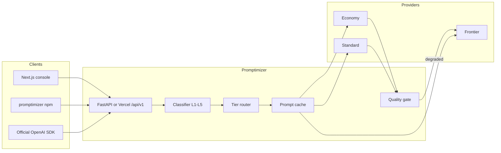

# Promptimizer

Quality-aware LLM routing for any OpenAI-compatible key.

Promptimizer sits in front of a cheap model and a frontier model (real providers or the built-in simulator). It classifies each request, routes it to the cheapest adequate tier, caches repeated system/context prefixes, and reports **cost saved versus always-frontier** on a fixed benchmark — together with a **quality score**, so savings that come from silently worse answers are visible.

**BYOK.** Paste an OpenAI, Groq, OpenRouter, Together, Fireworks, DeepSeek, or Ollama key. We fetch `/v1/models`, auto-tier them, and route.

## Why this stack

| Piece | Choice | Why |
| --- | --- | --- |
| Gateway | FastAPI / Python 3.12 | Brief-suggested, excellent OpenAPI, easy for judges to read |
| Console + marketing | Next.js 15 on Vercel | First-visit product surface, serverless `/api/v1` so the live demo is self-contained |
| SDK | TypeScript, `npm i promptimizer` | Dynaroute-style drop-in + offline classifier |
| Cache | In-memory or Redis | Prompt-prefix hits in Compose; memory for the simulator |
| Deploy | Docker Compose + Vercel | Production-shaped local, one-click web |

Theme is jet chrome with a **gold** accent — savings you can see, not another purple AI gradient.

## Architecture



## Monorepo

```
apps/api          FastAPI gateway, classifier, cache, benchmark
apps/web          Next.js marketing + console
packages/sdk      promptimizer npm package
docs/             API, frontend, SDK, architecture
```

## Run locally

```bash
# JS workspace (npm or pnpm)
npm install
npm run dev:web
# or: pnpm install && pnpm --filter @promptimizer/web dev

# Python gateway (optional — the web app already serves /api/v1)
cd apps/api
python3 -m venv .venv
.venv/bin/pip install -e ".[dev]"
.venv/bin/uvicorn app.main:app --reload --port 8000
```

Open [http://localhost:3000](http://localhost:3000). Start the **simulator** — no vendor key required.

```bash
docker compose up --build
```

Set `PROMPTIMIZER_API_URL=http://localhost:8000` on the web process if you want Next.js to proxy into FastAPI instead of the serverless engine.

## Tests

```bash
cd apps/api && .venv/bin/pytest -q
pnpm --filter promptimizer test
```

## Docs

- [How it works](docs/architecture.md)
- [API reference](docs/api.md)
- [Frontend](docs/frontend.md)
- [SDK](docs/sdk.md)

Interactive OpenAPI: `http://localhost:8000/docs`

## License

MIT
